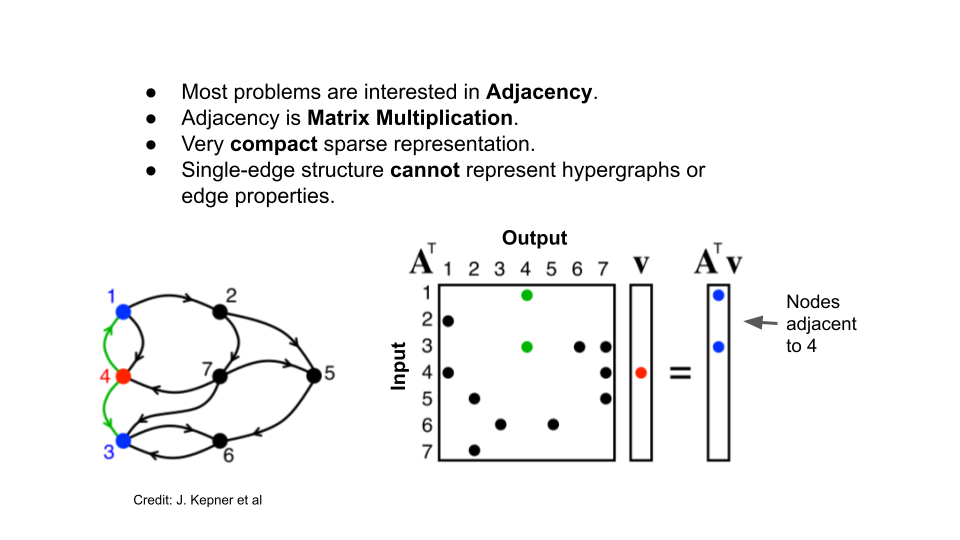
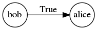
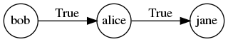
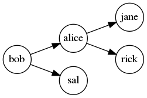
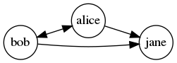
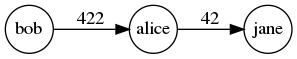
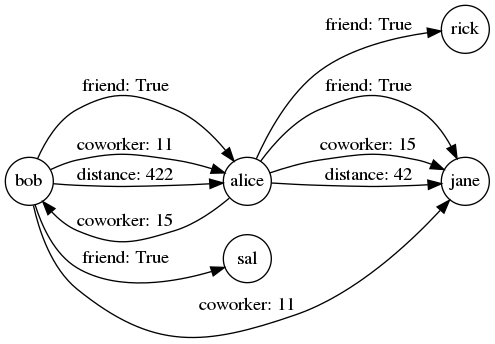
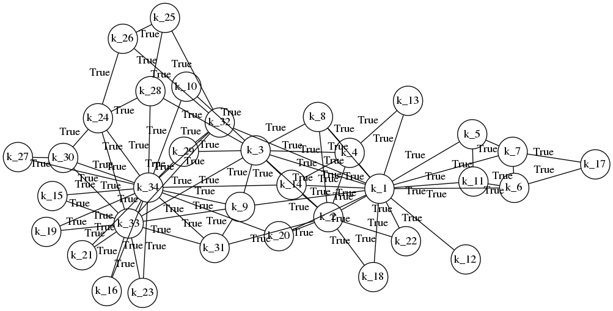
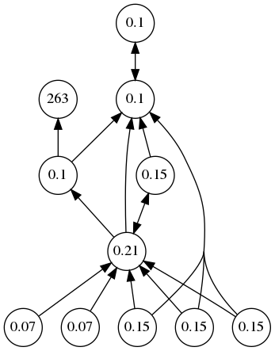

# Graphony

Graphony is a Python library for doing high-performance graph analysis
using the GraphBLAS over sparse and hypersparse data sets.

Graphony uses
[pygraphblas](https://graphegon.github.io/pygraphblas/pygraphblas/index.html)
to store graph data in sparse [GraphBLAS
Matrices](http://graphblas.org) and node and edge properties in
[PostgreSQL](https://postgresql.org).

Graphony's primary role is to easily construnct graph matrices and
manage symbolic names and properties for graphs, nodes, relations and
edges, and can be used to easily construct, save and manage graph data
in a simple project directory format.

Graphs can be:

  - [Simple](https://en.wikipedia.org/wiki/Graph_(discrete_mathematics)#Graph):
    an edge connects one source to one destination.

  - [Hypergraph](https://en.wikipedia.org/wiki/Hypergraph): a graph
    with at lest one *hyperedge* connecting multiple source nodes to
    multiple destinations.

  - [Multigraph](https://en.wikipedia.org/wiki/Multigraph): multiple
    edges can exist between a source and destination.

  - [Property
    Graph](http://graphdatamodeling.com/Graph%20Data%20Modeling/GraphDataModeling/page/PropertyGraphs.html):
    Nodes and and Edges can have arbitrary JSON properties.


# Introduction

A graph is set of nodes connected by edges.  Edges are typed and group
into named collections called *relations*.  Each relation holds edges
in one of two forms, an [adjancency
matrix](https://en.wikipedia.org/wiki/Adjacency_matrix) which can hold
a simple graph with directed or undirected 1-to-1 edges:



Or a graph can be stored by two [incidence
matrices](https://en.wikipedia.org/wiki/Incidence_matrix), which can
hold multigraphs and hypergraphs where multiple edges can connect the
same nodes, and multiple nodes can connect the same edges.  In either
case the edge weights can be any of the standard GraphBLAS types, or a
User Defined Type.

Interally The GraphBLAS works row and column position indexes, which
are a 60-bit integer key, so one of Graphony's key tasks is keeping
track of node indexes and the names they map to.  These mappings are
stored in PostgreSQL.  It's important to note that the graph structure
itself is not stored in PostgreSQL instead the structure is stored in
GraphBLAS matrices. Only the node id and name mappings and node and
edge properties are stored in the database.

# Creating Graphs

This documentation is also a runnable Python test called a
[doctest]().  In order to run and verify this documentation, we must
first create some helper objects like a function `p()` that will
iterate results into a list and "pretty print" them.  We also have to
setup a test PostgreSQL database and initialize it with the base
Graphony tables.

The core object of Graphony is a `Graph()`. A new Graph can be created
with a connection string to an existing initialized database:

<!--phmdoctest-setup-->
```python3
import os
import pprint
import postgresql
from pathlib import Path
from pygraphblas import FP64
from graphony import Graph, Node
p = lambda r: pprint.pprint(sorted(list(r)))
pgdata, conn = postgresql.setup()
postgresql.psql(f'-d "{conn}" -f dbinit/01.sql -f dbinit/02.sql')
G = Graph(conn)
```

The `Graph` object `G` is used throughout the following documenation
to demonstrate the features of Graphony.  A Graphony `Graph` consists
of four concepts:

  - `Graph`: Top level object that contains all graph data in
    sub-graphs called *relations*.

  - `Relation`: A named, typed sub-graph that holds edges.  A
    relation consists of two GraphBLAS [Incidence
    Matrices](https://en.wikipedia.org/wiki/Incidence_matrix) that can
    be multiplied to project an adjacency with themselves, or any
    other combination of relations.

  - `Edge`: Relation edges can be simple point to point edges or
    hyperedges that represent relations between multiple incoming and
    outgoing nodes.

  - `Node`: A node in the graph.

# Simple Graphs

Edges can be added directly into the Graph with the `+=` method.  In
their simplest form, an edge is a Python tuple with 3 elements, a
relation name, a source name, and a destination name:

Before you can add an edge, a relation to hold it must be declared
first.

```python3
>>> G.add_relation('friend')
```

Now edges in that relation can be added to the graph:

```python3
>>> G.friend += ('bob', 'alice')
>>> G.friend.draw(weights=False, filename='docs/imgs/G_friend_1')
<graphviz.dot.Digraph object at ...>
```


Using strings like `'bob'` and `'alice'` as edge endpoints creates new
graph nodes automatically.  You can also create nodes explicity and
provide properties for them:

```python3
>>> jane = Node(G, 'jane', favorite_color='blue')
>>> jane.props
{'favorite_color': 'blue'}
>>> G.friend += ('alice', jane)
>>> G.friend.draw(weights=False, filename='docs/imgs/G_friend_2')
<graphviz.dot.Digraph object at ...>
```


Now there are two edges in the `friend` relation, one from bob to
alice and the other from alice to jane.

```python3
>>> p(G.friend)
[friend(bob, alice), friend(alice, jane)]
```

An iterator of relation tuples can also be provided:

```python3
>>> G.friend += [('bob', 'sal'), ('alice', 'rick')]
>>> G.friend.draw(weights=False, filename='docs/imgs/G_friend_3')
<graphviz.dot.Digraph object at ...>
```


As shown above, tuples with 3 elements (triples), are stored as
boolean edges whose weights are always `True` and therefore can be
ommited.

# Hypergraphs

A hypergraph is a generalization of a graph in which an edge can join
any number of vertices in constrast to a simple graph, shown above,
where an edge has exactly two endpoints and can only connect only one
vertex to one other vertex.

In Graphony a hypergraph can created in any *incidence* relation by
passing the `incidence=True` flag.

```python3
>>> G.add_relation('coworker', incidence=True)
```

New hyperedges can be defined by passing a tuple of nodes as either
the source or destinations, or both, for a hyperedge.

```python3
>>> G.coworker += [('bob', ('jane', 'alice')), (('alice', 'bob'), 'jane')]
>>> G.coworker.draw(weights=True, filename='docs/imgs/G_coworker_1')
<graphviz.dot.Digraph object at ...>
```


# Property Graph

Graphs can have any number of relations, each with a particular
GraphBLAS type.  The default type is `BOOL` which created unweighted
edges, but graph edge types can be specified on a per-relation basis:

```python3
>>> G.add_relation('distance', int)
>>> G.distance += [('bob', 'alice', 422), ('alice', 'jane', 42)]
>>> G.distance.draw(weights=True, filename='docs/imgs/G_distance_2')
<graphviz.dot.Digraph object at ...>
```


# Graph Querying

Currently our graph looks like this, it contains 3 relations,
`friend`, `coworker` and `distance`:

```python3
>>> G.draw(weights=True, filename='docs/imgs/G_all_1')
<graphviz.dot.Digraph object at ...>
```



Graphs have a call interface like `G(...)` that can be used to query
individual edges.  A query consists of three optional arguments for
`source`, `relation` and `destination`.  The default value for all
three is None, which acts as a wildcard to matches all values.

```python3
>>> p(G())
[friend(bob, alice),
 friend(bob, sal),
 friend(alice, jane),
 friend(alice, rick),
 coworker((bob), (alice, jane), (True, True)),
 coworker((bob, alice), (jane), (True)),
 distance(bob, alice, 422),
 distance(alice, jane, 42)]
```

Only print edges where `bob` is the src:

```python3
>>> p(G(source='bob'))
[friend(bob, alice),
 friend(bob, sal),
 coworker((bob), (alice, jane), (True, True)),
 coworker((bob, alice), (jane), (True)),
 distance(bob, alice, 422)]
```

Only print edges where `coworker` is the relation:

```python3
>>> p(G(relation='coworker'))
[coworker((bob), (alice, jane), (True, True)),
 coworker((bob, alice), (jane), (True))]

```

Only print edges where `jane` is the destination:

```python3
>>> p(G(destination='jane'))
[friend(alice, jane),
 coworker((bob), (alice, jane), (True, True)),
 coworker((bob, alice), (jane), (True)),
 distance(alice, jane, 42)]
```

Only print edges that match that `bob` is a `coworker` of `jane`.
Note in this case it returns two hyperedges, as in both cases bob is a
source and jane is a destination:

```python3
>>> p(G(source='bob', relation='coworker', destination='jane'))
[coworker((bob), (alice, jane), (True, True)),
 coworker((bob, alice), (jane), (True))]
```

# Loading Graphs from SQL

Any tuple producing iterator can be used to construct Graphs.
Graphony offers a shorthand helper for this.  Any query that
produces 3 or 4 columns can be used to produce edges into the
graph.

```python3
>>> G.add_relation('karate')
>>> G.karate += G.sql(
...  "select 'k_' || s_id, 'k_' || d_id "
...  "from graphony.karate")
>>> G.karate.draw(weights=False, filename='docs/imgs/G_karate_3',
...               directed=False, graph_attr=dict(layout='sfdp'))
<graphviz.dot.Graph object at ...>
```


All the edges are in the karate relation, as defined in the sql
query above:

```python3
>>> len(G.karate)
78
```
# Graph Algorithms

Graphony uses The GraphBLAS API to store graphs and runs graph
algorithms by doing parallel sparse matrix multiplication using
the SuiteSparse:GraphBLAS library.

Matrix multiplication is a very power, but rather abstract
approach to writing graph algorithms, and it can be tricky to
writem common algorithms optimially form scratch, so Graphony
contains some common graph algorithms which can also act as
starting points for custom algorithms:

# PageRank

```python3
>>> G
<Graph [friend, coworker, distance, karate]: 87>

>>> from graphony.lib import pagerank
>>> G.add_relation('PR')
>>> I = "BCDEFDEEFGGHHIIJK"
>>> J = "CBBBBADFEBEBEBEEE"
>>> G.PR += zip(I, J)
>>> rank, iters = pagerank(G.PR(cast=FP64))
>>> G.PR.draw(weights=False, filename='docs/imgs/G_PR_1', rankdir='BT',
...           label_vector=rank, label_width=4)
<graphviz.dot.Digraph object at ...>
```


<!--phmdoctest-teardown-->
```python3
postgresql.teardown(pgdata)
```
