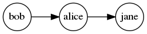
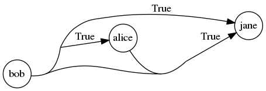
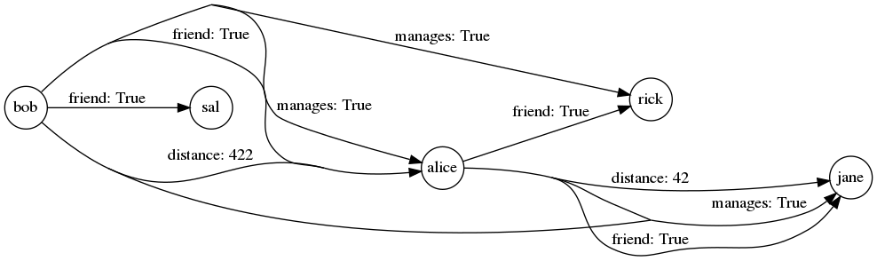
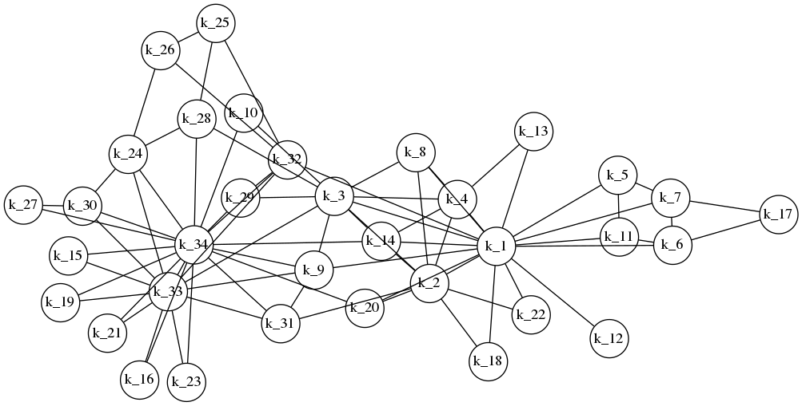
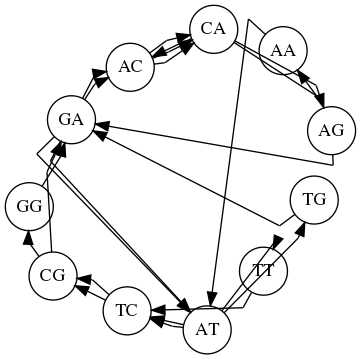
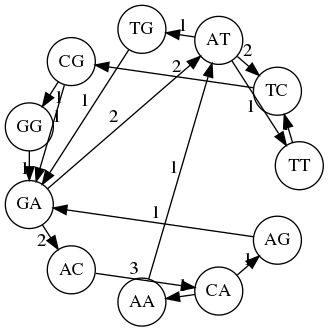
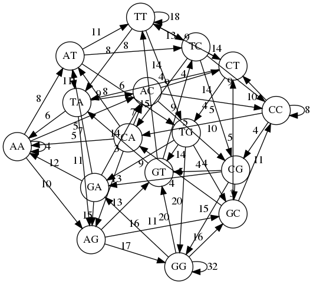
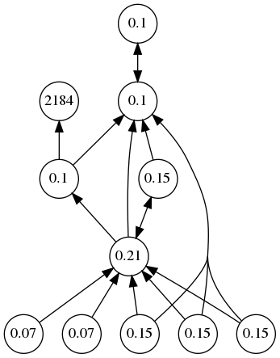

# Graphony

Graphony is a Python library for doing high-performance graph analysis
using the GraphBLAS over sparse and hypersparse data sets.

Graphony uses
[pygraphblas](https://graphegon.github.io/pygraphblas/pygraphblas/index.html)
to store graph data in sparse [GraphBLAS
Matrices](http://graphblas.org) and node and edge properties in
[PostgreSQL](https://postgresql.org).

Graphony's primary role is to easily construnct graph matrices and
manage symbolic names and properties for graphs, nodes, relations and
edges, and can be used to easily construct, save and manage graph data
in a simple project directory format.

Graphs can be:

  - [Simple](https://en.wikipedia.org/wiki/Graph_(discrete_mathematics)#Graph):
    an edge connects one source to one destination.

  - [Hypergraph](https://en.wikipedia.org/wiki/Hypergraph): a graph
    with at lest one *hyperedge* connecting multiple source nodes to
    multiple destinations.

  - [Multigraph](https://en.wikipedia.org/wiki/Multigraph): multiple
    edges can exist between a source and destination.

  - [Property
    Graph](http://graphdatamodeling.com/Graph%20Data%20Modeling/GraphDataModeling/page/PropertyGraphs.html):
    Nodes and and Edges can have arbitrary JSON properties.

# Creating Graphs

This documentation is also a runnable Python test called a
[doctest]().  In order to run and verify this documentation, we must
first create some helper objects like a function `p()` that will
iterate results into a list and "pretty print" them.  We also have to
setup a test PostgreSQL database and initialize it with the base
Graphony tables.

The core object of Graphony is a `Graph()`. A new Graph can be created
with a connection string to an existing initialized database:

<!--phmdoctest-setup-->
```python3
import os
import pprint
import postgresql
from pathlib import Path
from pygraphblas import FP64, INT64, gviz
from graphony import Graph, Node
p = lambda r: pprint.pprint(sorted(list(r)))
pgdata, conn = postgresql.setup()
postgresql.psql(f'-d "{conn}" -f dbinit/01.sql -f dbinit/02.sql')
G = Graph(conn)
```

The `Graph` object `G` is used throughout the following documenation
to demonstrate the features of Graphony.  A Graphony `Graph` consists
of four concepts:

  - `Graph`: Top level object that contains all graph data in
    sub-graphs called *relations*.

  - `Relation`: A named, typed sub-graph that holds edges.  A
    relation consists of two GraphBLAS [Incidence
    Matrices](https://en.wikipedia.org/wiki/Incidence_matrix) that can
    be multiplied to project an adjacency with themselves, or any
    other combination of relations.

  - `Edge`: Relation edges can be simple point to point edges or
    hyperedges that represent relations between multiple incoming and
    outgoing nodes.

  - `Node`: A node in the graph.

# Simple Graphs

Graphs consist of multiple typed subgraphs called *relations*.  All
relations share node ids across a Graph object, but each relation can
store edge weights of different data types like int, float, or bool.
Internally, "simple" graphs (non-hyper) are stored as [Adjacency
Matrices](https://en.wikipedia.org/wiki/Adjacency_matrix).

Before you can add an edge, a relation to hold it must be declared
first.  The default edge type is `bool` if you don't specify one:

```python3
>>> G.add_relation('friend')
```

Edges can be added directly into the Graph with the `+=` method.  In
their simplest form, an edge is a Python tuple with 2 elements a
source and a destination:

```python3
>>> G.friend += ('bob', 'alice')

>>> G.friend.draw(weights=False, filename='docs/imgs/G_friend_1')
<graphviz.dot.Digraph object at ...>
```


Using strings like `'bob'` and `'alice'` as edge endpoints creates new
graph nodes automatically.  You can also create nodes explicity and
provide properties for them:

```python3
>>> jane = Node(G, 'jane', favorite_color='blue')
>>> jane.props
{'favorite_color': 'blue'}
>>> G.friend += ('alice', jane)

>>> G.friend.draw(weights=False, filename='docs/imgs/G_friend_2')
<graphviz.dot.Digraph object at ...>
```


Now there are two edges in the `friend` relation, one from bob to
alice and the other from alice to jane.

```python3
>>> p(G.friend)
[friend(bob, alice), friend(alice, jane)]
```

An iterator of relation tuples can also be provided to the `+=`
operator which will consume them and add them to the relation:

```python3
>>> G.friend += [('bob', 'sal'), ('alice', 'rick')]

>>> G.friend.draw(weights=False, filename='docs/imgs/G_friend_3')
<graphviz.dot.Digraph object at ...>
```


As shown above, tuples are stored as boolean edges whose weights are
always `True` and therefore can be ommited.

# Hypergraphs

A [Hypergraph](https://en.wikipedia.org/wiki/Hypergraph) is a
generalization of a graph in which an edge can join any number of
vertices in constrast to a simple graph, shown above, where an edge
has exactly two endpoints and can only connect only one vertex to one
other vertex.

In Graphony a hypergraph can created in any *incidence* relation by
passing the `incidence=True` flag.  This causes the relation to be
stored internally as two [Incidence
Matrices](https://en.wikipedia.org/wiki/Incidence_matrix) which can
represent non-simple graphs like the hypergraph shown here:

```python3
>>> G.add_relation('coworker', incidence=True)
```

New hyperedges can be defined by passing a nested tuple of nodes as
either the source or destinations, or both, for a hyperedge.

```python3
>>> G.coworker += [('bob', ('jane', 'alice')), (('alice', 'bob'), 'jane')]

>>> G.coworker.draw(weights=True, filename='docs/imgs/G_coworker_1')
<graphviz.dot.Digraph object at ...>
```


Here a hyperedge with one source and two destinations is created from
bob to jane and alice, and another with two sources and one
destination is created from alice and bob to jane.

# Property Graph

Graphs can have any number of relations, each with a particular
GraphBLAS type.  In general this is referred to as a Property Graph.
As shown above the default relation type is `bool` which created
unweighted edges, but graph edge types can be specified on a
per-relation basis:

```python3
>>> G.add_relation('distance', int)
>>> G.distance += [('bob', 'alice', 422), ('alice', 'jane', 42)]

>>> G.distance.draw(weights=True, filename='docs/imgs/G_distance_2')
<graphviz.dot.Digraph object at ...>
```


Supported python types include `bool`, `int`, `float` and `complex`
which are converted into the GraphBLAS types `GrB_BOOL`, `GrB_INT64`,
`GrB_FP64` and `GxB_FC64` for storage.  You can also pass a specific
GraphBLAS type if you want different precision or a custom type.

# Graph Querying

Currently our graph looks like this, it contains 3 relations,
`friend`, `coworker` and `distance`:

```python3
>>> G.draw(weights=True, filename='docs/imgs/G_all_1')
<graphviz.dot.Digraph object at ...>
```



Graphs have a call interface like `G(...)` that can be used to query
individual edges.  A query consists of three optional arguments for
`source`, `relation` and `destination`.  The default value for all
three is None, which acts as a wildcard to matches all values.

```python3
>>> p(G())
[friend(bob, alice),
 friend(bob, sal),
 friend(alice, jane),
 friend(alice, rick),
 coworker((bob), (alice, jane), (True, True)),
 coworker((bob, alice), (jane), (True)),
 distance(bob, alice, 422),
 distance(alice, jane, 42)]
```

Only print edges where `bob` is the src:

```python3
>>> p(G(source='bob'))
[friend(bob, alice),
 friend(bob, sal),
 coworker((bob), (alice, jane), (True, True)),
 coworker((bob, alice), (jane), (True)),
 distance(bob, alice, 422)]
```

Only print edges where `coworker` is the relation:

```python3
>>> p(G(relation='coworker'))
[coworker((bob), (alice, jane), (True, True)),
 coworker((bob, alice), (jane), (True))]

```

Only print edges where `jane` is the destination:

```python3
>>> p(G(destination='jane'))
[friend(alice, jane),
 coworker((bob), (alice, jane), (True, True)),
 coworker((bob, alice), (jane), (True)),
 distance(alice, jane, 42)]
```

Only print edges that match that `bob` is a `coworker` of `jane`.
Note in this case it returns two hyperedges, as in both cases bob is a
source and jane is a destination:

```python3
>>> p(G(source='bob', relation='coworker', destination='jane'))
[coworker((bob), (alice, jane), (True, True)),
 coworker((bob, alice), (jane), (True))]
```

# Loading Graphs from SQL

Any tuple producing iterator can be used to construct Graphs.
Graphony offers a shorthand helper for this.  Any query that produces
2 or 3 columns can be used to produce edges into the graph.

```python3
>>> G.add_relation('karate')
>>> G.karate += G.sql("select 'k_' || s_id, 'k_' || d_id from graphony.karate")

>>> G.karate.draw(weights=False, filename='docs/imgs/G_karate_3',
...               directed=False, graph_attr=dict(layout='sfdp'))
<graphviz.dot.Graph object at ...>
```


All the edges are in the karate relation, as defined in the sql
query above:

```python3
>>> len(G.karate)
78
```

# Multigraphs

In a [Multigraph](https://en.wikipedia.org/wiki/Multigraph) multiple
edges can exist between two nodes.  A good example is a [De
Bruijn](https://en.wikipedia.org/wiki/De_Bruijn_graph) graph, a
directed graph that represents overlapping sequences of symbols.

These graphs are used in bioinformatics to analyze and assemble long
sequences of genetic data.  Construction involves iterating a sequence
of genetic information and constructing multiple edges between pairs
of nodes.

```python3
>>> from more_itertools import windowed
>>> G.add_relation('debruijn', incidence=True)
>>> def kmer(t, k=3): 
...     return (tuple(map("".join, windowed(i, k-1))) for i in map("".join, windowed(t, k)))
>>> G.debruijn += kmer('ATCGATCGGATGACAGACACAATTC')
>>> G.debruijn.draw(graph_attr=dict(layout='circo'), weights=False, concentrate=True, filename='docs/imgs/G_debruijn_1')
<graphviz...>
```


Once the graph is built up it can be "collapsed" into a weighted
graph, where the multi-edges between nodes are summed up into a single
edge.  In the GraphBLAS this can be accomplished by calling the
relations with a semiring:

```python3
>>> M = G.debruijn(INT64.plus_pair)
>>> gviz.draw_graph(M, weights=True, label_vector=G.debruijn.label_vector(M), 
...                 graph_attr=dict(layout='circo'), filename='docs/imgs/G_debruijn_2')
<graphviz...>
```


# Example Weighted De Bruijn using BioPython

Here's an example or using [Biopython](https://biopython.org/) to
create an weighted De Bruijn graph of a Circovirus:

```python3
>>> from Bio import SeqIO, Entrez
>>> Entrez.email = "info@graphegon.com"
>>> handle = Entrez.efetch(db="nucleotide", id="MZ299081", rettype="gb", retmode="text")
>>> record = SeqIO.read(handle, "genbank")
>>> handle.close()
>>> from more_itertools import windowed
>>> G.add_relation('circovirus', incidence=True)
>>> def kmer(t, k=3): 
...     return (tuple(map("".join, windowed(i, k-1))) for i in map("".join, windowed(t, k)))
>>> seq = str(record.seq)
>>> G.circovirus += kmer(seq, 3)
>>> M = G.circovirus(INT64.plus_pair)
>>> gviz.draw_graph(M, weights=True, labels=True, label_vector=G.circovirus.label_vector(M),
...                 graph_attr=dict(layout='sfdp'), filename='docs/imgs/G_circovirus_1')
<graphviz...>
```


# Graph Algorithms

Graphony uses The GraphBLAS API to store graphs and runs graph
algorithms by doing parallel sparse matrix multiplication using
the SuiteSparse:GraphBLAS library.

Matrix multiplication is a very power, but rather abstract
approach to writing graph algorithms, and it can be tricky to
writem common algorithms optimially form scratch, so Graphony
contains some common graph algorithms which can also act as
starting points for custom algorithms:

# PageRank

```python3
>>> G
<Graph [friend, coworker, distance, karate, debruijn, circovirus]: 750>

>>> from graphony.lib import pagerank
>>> G.add_relation('PR')
>>> I = "BCDEFDEEFGGHHIIJK"
>>> J = "CBBBBADFEBEBEBEEE"
>>> G.PR += zip(I, J)
>>> rank, iters = pagerank(G.PR(cast=FP64))

>>> G.PR.draw(weights=False, filename='docs/imgs/G_PR_1', rankdir='BT',
...           label_vector=rank, label_width=4)
<graphviz.dot.Digraph object at ...>
```


<!--phmdoctest-teardown-->
```python3
postgresql.teardown(pgdata)
```
