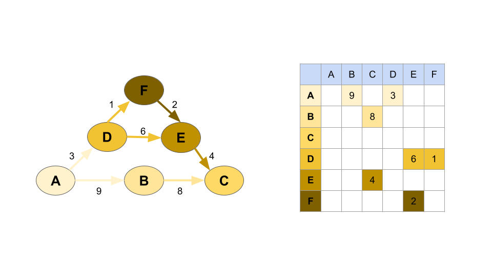
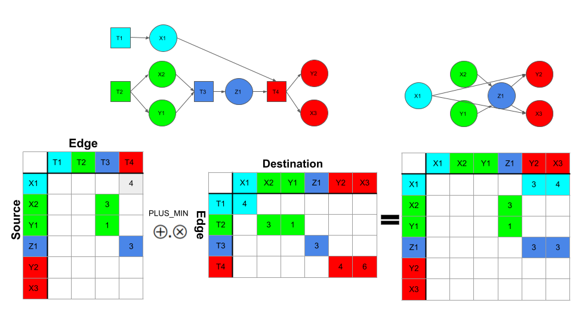
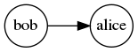

# Graphony: Hypersparse Hypergraphs

Graphony is a Python library for doing high-performance graph analysis
using the GraphBLAS over sparse and hypersparse data sets.  

Graphony uses
[pygraphblas](https://graphegon.github.io/pygraphblas/pygraphblas/index.html)
to store graph data in sparse [GraphBLAS
Matrices](http://graphblas.org) and node and edge properties in
[PostgreSQL](https://postgresql.org).

Graphony's primary role is to easily construnct graph matrices and
manage symbolic names and properties for graphs, nodes, relations and
edges, and can be used to easily construct, save and manage graph data
in a simple project directory format.

Graphs can be:

  - [Simple](https://en.wikipedia.org/wiki/Graph_(discrete_mathematics)#Graph):
    an edge connects one source to one destination.

  - [Hypergraph](https://en.wikipedia.org/wiki/Hypergraph): a graph
    with at lest one *hyperedge* connecting multiple source nodes to
    multiple destinations.

  - [Multigraph](https://en.wikipedia.org/wiki/Multigraph): multiple
    edges can exist between a source and destination.

  - [Property
    Graph](http://graphdatamodeling.com/Graph%20Data%20Modeling/GraphDataModeling/page/PropertyGraphs.html):
    Nodes and and Edges can have arbitrary JSON properties.


# Introduction

A graph is set of nodes connected by edges.  Edges are typed and group
into named collections called *relations*.  Each relation holds edges
in one of two forms, an [adjancency
matrix](https://en.wikipedia.org/wiki/Adjacency_matrix) which can hold
a simple graph with directed or undirected 1-to-1 edges:



Or a graph can be stored by two [incidence
matrices](https://en.wikipedia.org/wiki/Incidence_matrix), which can
hold multigraphs and hypergraphs where multiple edges can connect the
same nodes, and multiple nodes can connect the same edges.  In either
case the edge weights can be any of the standard GraphBLAS types, or a
User Defined Type.


It's usually helpful to be able to project a pair of incidence
matrices to an adjacency matrix using matrix multiplication.  This
"collapses" a hypergraph into a regular directed graph with simple
edges:



Interally The GraphBLAS works row and column position indexes, which
are a 60-bit integer key, so one of Graphony's key tasks is keeping
track of node indexes and the names they map to.  These mappings are
stored in PostgreSQL.  It's important to note that the graph structure
itself is not stored in PostgreSQL instead the structure is stored in
GraphBLAS matrices. Only the node id and name mappings and node and
edge properties are stored in the database.

## Creating Graphs

To demonstrate, first let's create a helper function `p()` that will
iterate results into a list and "pretty print" them.  This isn't
necessary to use Graphony, but is only to help format and verify the
output of this documentation.  Next, create a new Graph object and
connect it to a database:

<!--phmdoctest-setup-->
```python3
import pprint
import postgresql
from graphony import Graph, Node
p = lambda r: pprint.pprint(sorted(list(r)))
pgdata, db_conn_string = postgresql.setup()
postgresql.psql(f'-d "{db_conn_string}" -f dbinit/01.sql -f dbinit/02.sql')
G = Graph(db_conn_string)
```

Graphony consists of four concepts:

  - Graph: Top level object that contains all graph data in
    sub-graphs called *relations*.

  - Relation: A named, typed sub-graph that holds edges.  A
    relation consists of two GraphBLAS [Incidence
    Matrices](https://en.wikipedia.org/wiki/Incidence_matrix) that can
    be multiplied to project an adjacency with themselves, or any
    other combination of relations.

  - Edge: Relation edges can be simple point to point edges or
    hyperedges that represent relations between multiple incoming and
    outgoing nodes.
    
  - Node: A node in the graph.

## Simple Graphs

Edges can be added directly into the Graph with the `+=` method.  In
their simplest form, an edge is a Python tuple with 3 elements, a
relation name, a source name, and a destination name:

Before you can add an edge, a relation to hold it must be declared
first.

```python3
>>> G.add_relation('friend')
```

Now edges in that relation can be added to the graph:

```python3
>>> G.friend += ('bob', 'alice')
>>> G.friend.draw(show_weight=False, filename='docs/imgs/G_friend_1')
<graphviz.dot.Digraph object at ...>
```


Using strings like `'bob'` and `'alice'` as edge endpoints creates new
graph nodes automatically.  You can also create nodes explicity and
provide properties for them:

```python3
>>> jane = Node(G, 'jane', favorite_color='blue')
>>> jane.props
{'favorite_color': 'blue'}
>>> G.friend += ('alice', jane)
>>> G.friend.draw(show_weight=False, filename='docs/imgs/G_friend_2')
<graphviz.dot.Digraph object at ...>
```


Now there are two edges in the `friend` relation, one from bob to
alice and the other from alice to jane.

```python3
>>> p(G)
[(friend, bob, alice, True), (friend, alice, jane, True)]
```

An iterator of relation tuples can also be provided:

```python3
>>> G.friend += [('bob', 'sal'), ('alice', 'rick')]
>>> G.friend.draw(show_weight=False, filename='docs/imgs/G_friend_3')
<graphviz.dot.Digraph object at ...>
```


As shown above, tuples with 3 elements (triples), are stored as
boolean edges whose weights are always `True` and therefore can be
ommited.

To create edges of a certain type, 4 elements can be provided:

```python3
>>> G.add_relation('coworker', incidence=True)
>>> G.coworker += [('bob', 'jane'), ('alice', 'jane')]

>>> G.add_relation('distance', int)
>>> G.distance += [('chicago', 'seattle', 422),
...                ('seattle', 'portland', 42)]
```

## Graph Querying

The graph can then be called like `G(...)` to examine it.  A query
consists of three optional arguments for `relation`, 'source' and
`destination`.  The default value for all three is None, which
acts as a wildcard to matches all values.

```python3
>>> p(G())
[(friend, bob, alice, True),
 (friend, bob, sal, True),
 (friend, alice, jane, True),
 (friend, alice, rick, True),
 (coworker, bob, jane, True),
 (coworker, alice, jane, True),
 (distance, chicago, seattle, 422),
 (distance, seattle, portland, 42)]
```

Only print relations where `bob` is the src:

```python3
>>> p(G(source='bob'))
[(friend, bob, alice, True),
 (friend, bob, sal, True),
 (coworker, bob, jane, True)]
```

Only print relations where `coworker` is the relation:

```python3
>>> p(G(relation='coworker'))
[(coworker, bob, jane, True), (coworker, alice, jane, True)]
```

Only print relations where `jane` is the dest:

```python3
>>> p(G(destination='jane'))
[(friend, alice, jane, True),
 (coworker, bob, jane, True),
 (coworker, alice, jane, True)]

>>> p(G(source='bob', relation='coworker', destination='jane'))
[(coworker, bob, jane, True)]
```

Edges can be tested to see if they are contained in the Graph:

Relations are accessible as attributes of the graph:

```python3
>>> G.friend
<Adjacency friend BOOL:4>

>>> G.coworker
<Incidence coworker BOOL:2>
```

Relations can be iterated directly:

```python3
>>> p(list(G.friend))
[(friend, bob, alice, True),
 (friend, bob, sal, True),
 (friend, alice, jane, True),
 (friend, alice, rick, True)]
```

## Graph Algorithms

Graphony uses The GraphBLAS API to store graphs and runs graph
algorithms by doing parallel sparse matrix multiplication using
the SuiteSparse:GraphBLAS library.

Matrix multiplication is a very power, but rather abstract
approach to writing graph algorithms, and it can be tricky to
writem common algorithms optimially form scratch, so Graphony
contains some common graph algorithms which can also act as
starting points for custom algorithms:

>>>

## Query Graphs from SQL

Any tuple producing iterator can be used to construct Graphs.
Graphony offers a shorthand helper for this.  Any query that
produces 3 or 4 columns can be used to produce edges into the
graph.

```python3
>>> G.add_relation('karate')
>>> G.karate += G.sql(
...  "select 'karate_' || s_id, 'karate_' || d_id "
...  "from graphony.karate")
>>> G.karate.draw(show_weight=False, filename='docs/imgs/G_karate_1')
<graphviz.dot.Digraph object at ...>
```


All the edges are in the karate relation, as defined in the sql
query above:

```python3
>>> len(G.karate)
78
```
Inspecting G shows that it has three columns and six edges:

```python3
>>> G
<Graph [friend, coworker, distance, karate]: 86>
```

<!--phmdoctest-teardown-->
```python3
postgresql.teardown(pgdata)
```
